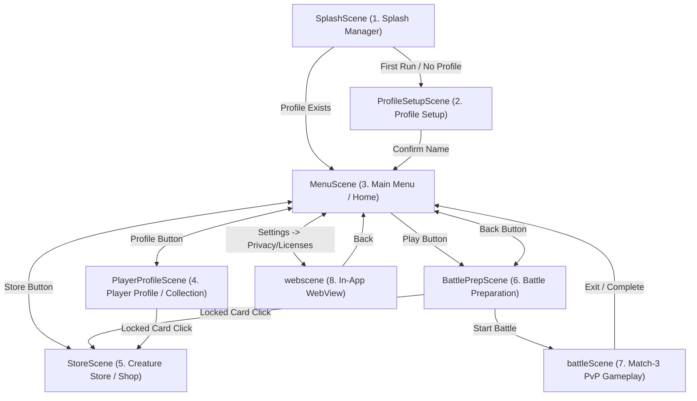

# Pokemon Legends — Scenes & UI Reference Manual

This document provides a breakdown of all scenes in the game, including their UI hierarchies, navigation paths, dynamic cards, and popups.

---

## Scene Flow Map

---

## 1. SplashScene
* **Description**: The launch screen of the application. Fades in a logo, bootstraps game systems (AdMob and Firebase), and determines initial routing.
* **UI Elements**:
  * **Main Logo / Background**: Displayed via a smooth canvas alpha fade-in.
* **Navigation / Flow**:
  * No user-facing buttons.
  * Automatically routes to:
    * `ProfileSetupScene` (if `IsProfileCreated` is false)
    * `MenuScene` (if `IsProfileCreated` is true)
* **Popups**:
  * **Consent Form Dialog** (AdMob): Loaded dynamically if checking consent returns `Required` or `Unknown` (e.g. in the EU or during test mode). Standard SDK modal allowing users to opt into personalized tracking/advertising.

---

## 2. ProfileSetupScene
* **Description**: First-run configuration screen where players enter a trainer name.
* **UI Elements**:
  * **Setup Panel**: Standard center-aligned card with a spring scale-in animation.
  * **Username Input Field**: `TMP_InputField` supporting up to 16 characters.
  * **Error Text**: Label below the input field that displays validation messages (e.g. if field is empty or length is < 2 characters).
* **Buttons & Actions**:
  * **Confirm Button**: Validates user entry, calls `PlayerProfileManager.GetInstance().CreateProfile(username)` (grants Ember Dragon and Thorn Wolf, sets initial 1,000 coins, and adds 200 starting XP), and loads `MenuScene`.
  * *Micro-Animation*: Submitting an invalid name triggers a shake animation on the text input field using DOTween.

---

## 3. MenuScene (Home)
* **Description**: Main player dashboard. Shows current level, coins, experience points, and bet options.
* **UI Elements**:
  * **Profile Header**: Displays profile status (Username, Coin balance, and Level).
  * **XP Progress Bar**: A horizontal fill bar and label showing current progression toward the next level (e.g., `120 / 300 XP`).
  * **Bet Selection Grid**: Dynamic selector presenting three entry stakes:
    * **BET 🪙250 / WIN 🪙500**
    * **BET 🪙500 / WIN 🪙1000**
    * **BET 🪙1000 / WIN 🪙2000**
    * *Behavior*: Clicking selects the fee. Non-affordable bets are greyed out. Insufficient funds warning is displayed directly beneath the play button.
* **Buttons & Actions**:
  * **Play Button**: Navigates to `BattlePrepScene`.
  * **Profile Button**: Navigates to `PlayerProfileScene`.
  * **Store Button**: Navigates to `StoreScene`.
  * **Settings Button**: Opens the `SettingView` settings overlay.
  * **Logout Button**: Triggers the Logout Confirmation popup.
  * **Remove Ads Button**: Triggers IAP purchase logic (removed if ads are disabled or previously purchased).
* **Popups**:
  * **Logout Confirmation Popup**:
    * *Description*: Prompt asking the user if they want to reset their save file.
    * *Buttons*: 
      * `YES`: Calls `PlayerProfileManager.Logout()` (clears all PlayerPrefs and state) and redirects back to `ProfileSetupScene`.
      * `NO`: Closes the overlay.
  * **Not Enough Coins Popup**:
    * *Description*: Warning dialog triggered if the player attempts to select a bet they cannot afford.
    * *Buttons*: 
      * `OK`: Closes the popup.

---

## 4. PlayerProfileScene
* **Description**: Gallery view that lists all owned creatures, displays their stats, and handles active battle team selection.
* **UI Elements**:
  * **Header Details**: Displays Username, level avatar circle (with bronze, silver, gold, or platinum ring based on level), XP fill bar, and collection status (e.g. `Collection: 2 / 12 Creatures`).
  * **Collection Grid**: ScrollRect parent housing grid items for all *owned* creatures.
* **Card Breakdown (Creature Card)**:
  * **Avatar**: Dynamic graphic generated procedurally based on creature type/species.
  * **NameText**: Creature name in white (e.g., "Ember Dragon").
  * **TypeText**: Gem category label (e.g. "Storm Category", "Fire Category") colored to match the element.
  * **StatsText**: Combat attributes (e.g., `ATK 20  ⚡5` representing base damage and stone energy capacity).
  * **PriceText**: Green text showing "Starter" or "Owned".
  * **TeamBadge**: Activated if in battle team. Displays "SLOT 1" or "SLOT 2" + "✓ BATTLE".
  * **Glow Outline**: Highlight frame demonstrating owner status.
* **Buttons & Actions**:
  * **Back Button**: Navigates back to `MenuScene`. Checks that the team contains exactly 2 ready creatures before loading (fails with warning if team is incomplete).
  * **Card Buttons**: Clicking a creature card opens the Details Popup.
* **Popups**:
  * **Details Popup** (Built dynamically):
    * *Description*: Modal overview presenting elemental details, base damage, evolved damage, and slot toggle buttons.
    * *Buttons*:
      * `✕ (Close)` (Top Right) & `CLOSE` (Bottom Left): Closes detail panel.
      * `USE FOR BATTLE` / `✓ REMOVE TEAM` (Bottom Right): Adds or removes the creature to/from the active team. Fails with popup warning if the team already has 2 active combatants.

---

## 5. StoreScene
* **Description**: Shop where locked creatures can be purchased with coins.
* **UI Elements**:
  * **Coin Banner**: Displays current player currency.
  * **Inventory Content**: ScrollRect housing all 12 creatures from the static catalogue.
* **Card Breakdown (Store Card)**:
  * Similar structure to the Creature Card, showing Avatar, Name, Type, and stats.
  * **PriceText**: Displays `🪙 <Price>` (e.g. `🪙 3000`) if locked, or "Owned ✓" / "Free (Starter)" if already owned.
  * **Buy Button**: Active green button if affordable, disabled grey showing "🪙 Needed" if coins are insufficient, and hidden entirely if already owned.
* **Buttons & Actions**:
  * **Back Button**: Navigates back to `MenuScene`.
  * **Card Button**: Opens the Purchase Popup.
* **Popups**:
  * **Purchase Popup** (Built dynamically):
    * *Description*: Displays full card stats alongside Ability Name (e.g. "Tackle") and Effect Description loaded from `CreatureAttackConfig`.
    * *Buttons*:
      * `✕ (Close)`: Cancels transaction.
      * `PURCHASE`: Green button displaying the price. Deducts coins, adds to owned collection, rewards XP proportional to purchase cost, and triggers the Result Popup. Disabled if unowned and unaffordable.
      * `ALREADY OWNED`: Non-interactive badge shown if owned.
  * **Result Popup**:
    * *Description*: Visual banner showing success/fail confirmation. Fades out after 2.5 seconds.

---

## 6. BattlePrepScene
* **Description**: Preparation board displaying owned creatures, allowing users to configure slots before fighting.
* **UI Elements**:
  * **Instruction Header**: Text reading "BATTLE PREPARATION - Prepare your team of 2 Creature for combat".
  * **Grid**: Content view populated with all *owned* creature cards.
* **Card Breakdown**:
  * Identical to the profile card. Indicates ready status ("✓ READY" in SLOT 1 or SLOT 2).
* **Buttons & Actions**:
  * **Back Button**: Returns to `MenuScene`.
  * **Start Battle Button**: Large button indicating the selected entry fee (e.g., `START BATTLE (🪙 250)`). Deducts entry fee and loads `battleScene`. Grayed out if the team size is not exactly 2 or the player has insufficient coins.
  * **Card Buttons**: Opens the Details Popup. If card is somehow locked, shows warning message redirection to the Store scene.
* **Popups**:
  * **Details Popup**: Identical to PlayerProfileScene details popup (allows slot toggling).
  * **No Coins Popup**: Prompts players if they cannot afford the battle entry fee, suggesting they return to the store or complete battles to accumulate coins.
    * *Buttons*: `OK` to close.

---

## 7. battleScene
* **Description**: Core match-3 board puzzle where players complete matches to attack an AI opponent.
* **UI Elements**:
  * **7x8 Stone Board**: Grid comprising elemental stones (Fire, Water, Nature, Electric, Psychic, Healing).
  * **Creature HUDs**: Health and energy metrics of the player's and opponent's team.
* **Buttons & Actions**:
  * **Exit Battle Button**: Triggers the Quit popup.
* **Popups**:
  * **Exit Confirmation Popup**:
    * *Description*: Dialog warning that quitting early counts as a loss.
    * *Buttons*:
      * `Yes`: Deducts fee, registers a loss (awarding 25 XP and 0 coins), and loads `MenuScene`.
      * `No`: Dismisses popup and resumes battle.
  * **Battle Complete Popup**:
    * *Description*: Victory/Defeat screen summarizing rewards earned.
    * *Buttons*: 
      * `HOME / CONTINUE`: Loads `MenuScene`.

---

## 8. webscene
* **Description**: Display portal using an in-app browser view to show support, licenses, and privacy documents.
* **UI Elements**:
  * **Title Header**: Shows the current category.
  * **WebView frame**: Renders target HTML policy text.
* **Buttons & Actions**:
  * **Close Button**: Loads `MenuScene`.
